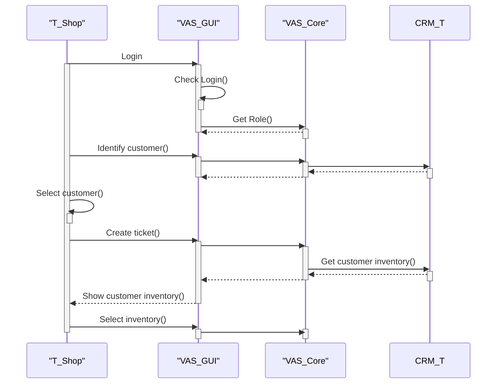

# Entry T--Shop

```mermaid
sequenceDiagram 
    participant T_Shop as "T_Shop"
    participant VAS_GUI as "VAS_GUI"
    participant VAS_Core as "VAS_Core"
    participant CRM_T as CRM_T
    
    T_Shop->>VAS_GUI: Login
    activate T_Shop
    activate VAS_GUI
    VAS_GUI->>VAS_GUI: Check Login()
    activate VAS_GUI
    deactivate VAS_GUI
    VAS_GUI->>VAS_Core: Get Role()
    activate VAS_Core
    VAS_Core-->>VAS_GUI: 
    deactivate VAS_Core
    deactivate VAS_GUI


    T_Shop ->> VAS_GUI: Identify customer()
    activate VAS_GUI
    VAS_GUI ->> VAS_Core: 
    activate VAS_Core
    VAS_Core ->> CRM_T: 
    activate CRM_T
    CRM_T -->> VAS_Core: 
    deactivate CRM_T
    VAS_Core -->> VAS_GUI: 
    deactivate VAS_Core
    deactivate VAS_GUI
    T_Shop ->> T_Shop: Select customer()
    activate T_Shop
    deactivate T_Shop

    T_Shop ->> VAS_GUI: Create ticket()
    activate VAS_GUI
    VAS_GUI ->> VAS_Core: 
    activate VAS_Core
    VAS_Core ->> CRM_T: Get customer inventory()
    activate CRM_T
    CRM_T -->> VAS_Core: 
    deactivate CRM_T
    VAS_Core -->> VAS_GUI: 
    deactivate VAS_Core
    VAS_GUI -->> T_Shop: Show customer inventory()
    deactivate VAS_GUI

    T_Shop ->> VAS_GUI: Select inventory()
    activate VAS_GUI
    VAS_GUI ->> VAS_Core: 
    activate VAS_Core
    deactivate VAS_Core
    deactivate VAS_GUI
    deactivate T_Shop
  

```
